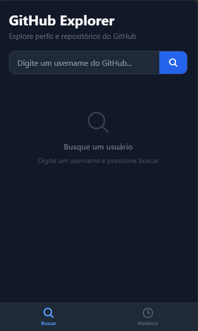
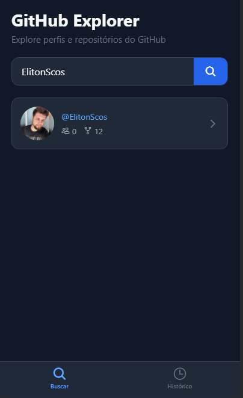
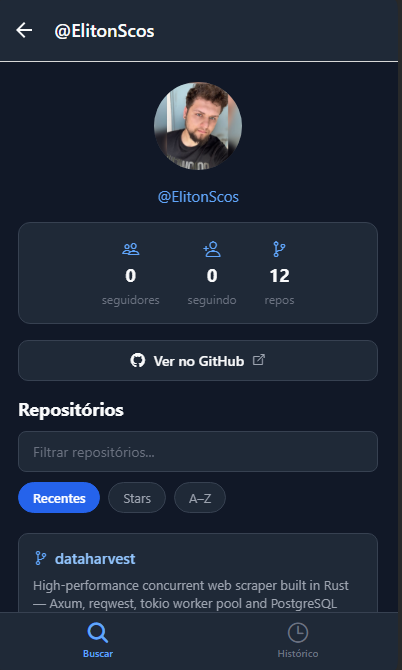
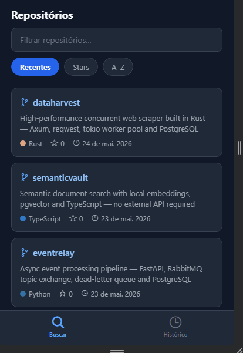
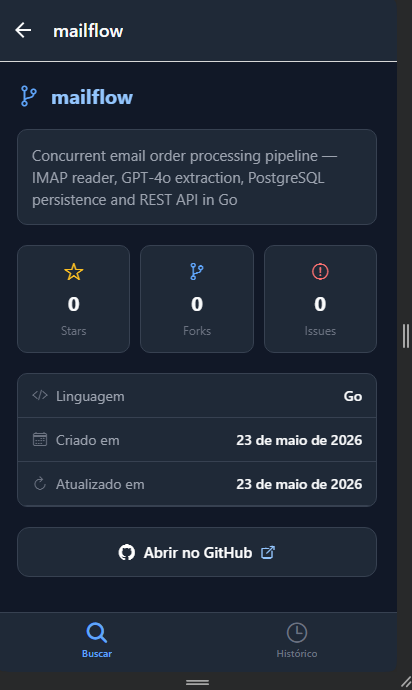
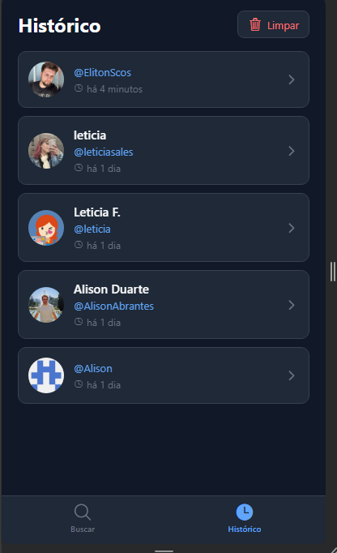

# GitHub User Explorer

Aplicativo mobile para explorar perfis e repositórios do GitHub, desenvolvido com React Native e Expo.

---

## Tecnologias utilizadas

| Tecnologia | Função |
|---|---|
| [React Native](https://reactnative.dev/) | Framework mobile |
| [Expo](https://expo.dev/) (SDK 54) | Toolchain e runtime |
| [TypeScript](https://www.typescriptlang.org/) | Tipagem estática |
| [React Navigation](https://reactnavigation.org/) | Navegação entre telas |
| [Axios](https://axios-http.com/) | Requisições HTTP |
| [AsyncStorage](https://react-native-async-storage.github.io/async-storage/) | Persistência local |
| [date-fns](https://date-fns.org/) | Formatação de datas |
| [Jest](https://jestjs.io/) + [jest-expo](https://github.com/expo/expo/tree/main/packages/jest-expo) | Testes unitários |

---

## Como configurar o ambiente

### Pré-requisitos

- [Node.js](https://nodejs.org/) 18 ou superior
- [Android Studio](https://developer.android.com/studio) com um emulador configurado (Android), **ou** Xcode com simulador (iOS, macOS apenas)

### Instalar as dependências

```bash
git clone https://github.com/seu-usuario/github-user-explorer.git
cd github-user-explorer
npm install
```

---

## Como rodar o projeto

### Android (emulador ou dispositivo físico)

```bash
npm run android
```

### iOS (simulador — macOS apenas)

```bash
npm run ios
```

### Iniciar o Metro manualmente

```bash
npm start
```

Com o Metro aberto, pressione `a` para Android ou `i` para iOS.

---

## Como rodar os testes

```bash
npm test
```

Os testes cobrem:
- `githubApi` — busca de usuários e repositórios, tratamento de 404
- `storage` — adicionar ao histórico, deduplicação, limpeza

---

## Arquitetura do projeto

```
github-user-explorer/
├── App.tsx                   # Ponto de entrada — providers e NavigationContainer
├── src/
│   ├── types/
│   │   └── index.ts          # Interfaces TypeScript (GithubUser, GithubRepository, HistoryEntry, rotas)
│   ├── services/
│   │   ├── githubApi.ts      # Chamadas à API pública do GitHub (axios)
│   │   └── storage.ts        # Persistência local do histórico (AsyncStorage)
│   ├── hooks/
│   │   ├── useGithubUser.ts  # Lógica de busca: estado, erros, chamada à API
│   │   └── useHistory.ts     # Leitura e limpeza do histórico local
│   ├── components/
│   │   ├── SearchBar.tsx     # Campo de busca com botão e estado de loading
│   │   ├── UserCard.tsx      # Card resumido de um usuário
│   │   ├── RepositoryCard.tsx# Card de repositório com language, stars, data
│   │   ├── HistoryItem.tsx   # Item do histórico com tempo relativo
│   │   └── EmptyState.tsx    # Tela de estado vazio/erro reutilizável
│   ├── screens/
│   │   ├── HomeScreen.tsx    # Tela de busca
│   │   ├── ProfileScreen.tsx # Perfil do usuário + lista de repositórios
│   │   ├── RepositoryScreen.tsx # Detalhes de um repositório
│   │   └── HistoryScreen.tsx # Histórico de perfis visitados
│   └── navigation/
│       └── AppNavigator.tsx  # Tab navigator (Buscar / Histórico) + Stack navigators
├── __tests__/
│   ├── githubApi.test.ts
│   └── storage.test.ts
└── __mocks__/
    ├── axios.js
    └── @react-native-async-storage/
        └── async-storage.js
```

### Decisões de arquitetura

- **Separação de responsabilidades:** cada camada tem papel único — serviços fazem I/O, hooks gerenciam estado, screens orquestram, componentes renderizam
- **Sem gerenciador de estado global:** o estado é local por tela; o histórico é carregado via `useFocusEffect` sempre que a aba ganha foco
- **Sem cache de API:** cada busca é fresca para garantir dados atualizados; a deduplicação do histórico é feita no storage para não repetir perfis
- **Tema escuro nativo:** todas as cores são hardcoded em dark mode — sem biblioteca de temas para manter o projeto simples

---

## Funcionalidades implementadas

- [x] Busca de usuários do GitHub por username
- [x] Tratamento de usuário não encontrado, campo vazio e erro de rede
- [x] Tela de detalhes do perfil (avatar, bio, seguidores, repos, link)
- [x] Listagem de repositórios com filtro por nome e ordenação (recentes / stars / A–Z)
- [x] Tela de detalhes do repositório (stars, forks, issues abertas, datas, tópicos, link)
- [x] Histórico local de perfis visitados com data relativa ("há 2 horas")
- [x] Persistência do histórico após fechar e reabrir o app
- [x] Navegação por abas (Buscar / Histórico)
- [x] Testes unitários (services)

---

## Prints das telas

| Tela Inicial | Busca de Usuário |
|---|---|
|  |  |

| Perfil do Usuário | Lista de Repositórios |
|---|---|
|  |  |

| Detalhes do Repositório | Histórico |
|---|---|
|  |  |
